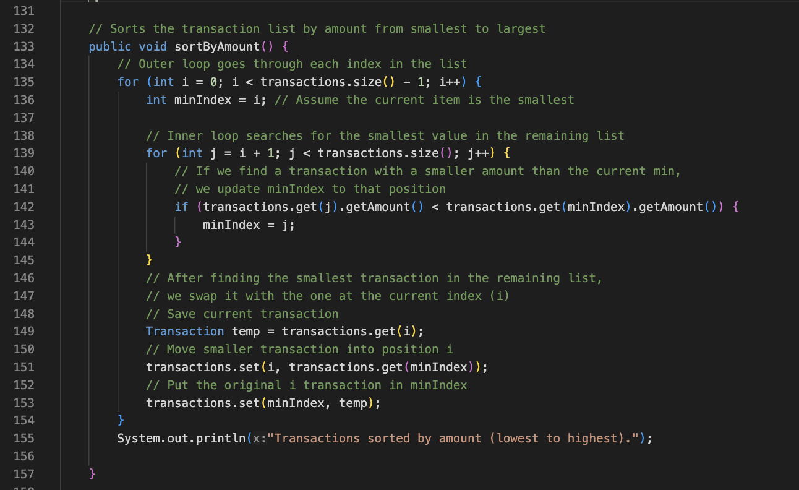
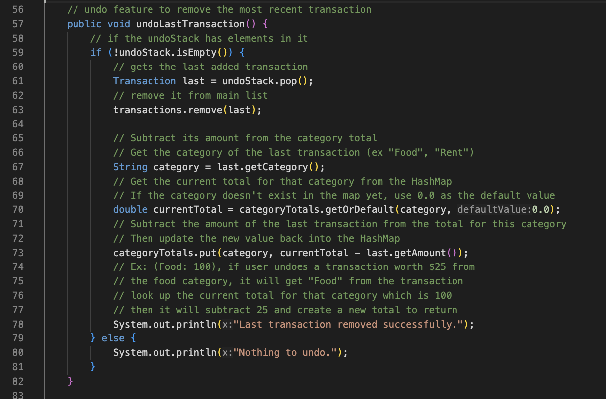
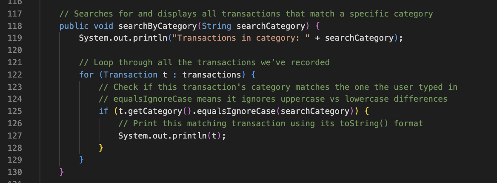

Sara Filipinas
7/14/25

Final Project Report

I created a Budget Tracker app, and this app is meant to be useful to support users in organizing and tracking their expenses to stay within their monthly budget! Users can add new expenses with custom categories and descriptions, view total spending, sort and search transactions, undo the last expense, and check whether they’re over budget. The goal is to promote financial habits in users because financial literacy is not usually taught in school!

The 3 algorithms I used:

Selection Sort - In my app I used selection sort by sorting expenses by amount. If the user selects the option to “Sort expenses by amount” the program organizes all transactions from the smallest to the largest amount using a Selection Sort. This gives the user a clear view of where the most and least money is being spent. I used this algorithm because its works nicely for short lists.

Steps 
1 - starts at first element in the transactions list
2 - assume it is the smallest, then compares it with all the others
3 - if a smaller one is found, update the smallest
4 - swap the current element with the smallest one
5 - move to the next index and repeat until list is sorted

Big-O: Worst case O(n^2) and best case O(n^2) because even if the list is already sorted it will still go through the entire list and compare every element with the rest

Stack - When the user wants to undo the last expense they added, the app removes the most recent transaction from the list. The last item is the first out. I used this because it gives the user a way to quickly reverse a mistake without having to search for and delete a specific entry.

Steps
1 - Check if the transactions list is not empty
2 - Remove the last item
3 - Notify the user it has been deleted

Big-O: O(1) it directly accesses and removes the last item in the list, no searching needed.

Linear Search - When the user types in a category such as food the app goes through each transaction and prints those that match the category name. Since the categories can be entirely made up by users this algoithm was helpful working with the dynamic.

Steps
1 - Ask user for category input
2 - Loop through each transaction in the list
3 - If the category matches, print the transaction
4 - If no results found, print no results

Big-O: Worst case O(n), Best case O(1) if transaction matches. It checks each item one by one until it finds a match.

I used 3 data structures which include an ArrayList to store the transactions, HashMap to calculate totals by category, and Stack to implement the undo feature.

Array List - I used this structure to store all the transactions. It allows resizing, which made it easy to add, remove, and access transactions by index. This structure was useful for organizing and displaying all transactions in the order they were added or sorted.

Stack - I used this structure to implement the undo feature. Since stacks use a last in, first out structure it made it easy to undo the most recent transaction by simply popping it off the stack.

HashMap - I used this to group transactions by category. The key is the category name like "Food", and the value is a list of transactions that belong to that category. This made it fast and efficient to search and display transactions by category.

A time in the design process when I encountered an opportunity to improve is when, I realized I could give users more control by letting them define their own expense categories instead of limiting them to specific options. This opportunity made the app more flexible and personal. I implemented it by allowing the user to enter a category name as a string when adding a new expense, and the app tracks it using a hashmap.

One error I faced was an InputMismatchException when the user entered a string when the program was expecting an integer such as, typing "toiletries" when choosing a menu option. This caused the program to crash. I resolved this by making sure the Scanner.nextInt() input was followed by a nextLine() to consume the newline, and by adding clear instructions to guide the user on what type of input was expected.

Something I would add in the future is a feature to add the users data of transactions into perhaps a text file, so that the transactions are saved for future usage and return.
